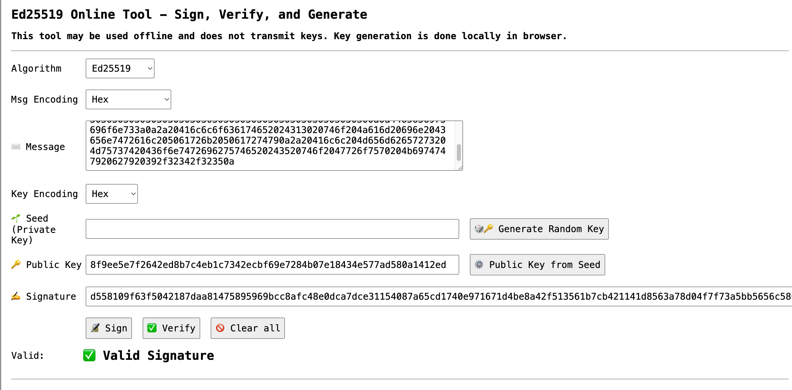

# 2.4: Checking FROST Signatures

If you receive a FROST signature, obviously you must be able to
check it!

> :book: ***What is Required to Verify a Signature?*** Verification of
a signature can typically be accomplished with three items: the
message, the signature, and the public key (which is typically called
the "verifying key" in relation to FROST).

Following are some methodologies for verifying the ed25519 signature
you created in [§2,3](02_3_Creating_FROST_Signature.md).

## Verifying on the Command Line

If you want to do additional work with `ed25519` signatures on the
command line,
[openssl](https://docs.openssl.org/master/man1/openssl-pkeyutl/) is
likely the best option as it now fully supports the algorithm. We've
opted not to use it here because of its complexity and the complexity
of converting file formats.

We hope to have better command-line solutions here as the FROST
ecosystem matures.

## Verifying on the Web

Currently, [cyphr.me](https://cyphr.me/ed25519_tool/ed.html) offers
the best option for verifying the signature you made with the ZF
FROST Tools. It's a web site that can be used to safely verify
ed25519-signed messages with public keys.



To use it:

* Choose the Algorithm as "ed25519"
* Choose Message Encoding as "hex"
* Paste the hex-encoded version of `board-meeting-250917.txt` (or any other message converted to hex) as "Message", e.g.: `446174653a20392f31372f32350a50726573656e743a20303130303030303030303030303030303030303030303030303030303030303030303030303030303030303030303030303030303030303030303030303030302c20303230303030303030303030303030303030303030303030303030303030303030303030303030303030303030303030303030303030303030303030303030300a0a4465636973696f6e733a0a2a20416c6c6f636174652024313020746f204a616d20696e2043656e7472616c205061726b2050617274790a2a20416c6c204d656d62657273204d75737420436f6e7472696275746520243520746f2047726f7570204b6974747920627920392f32342f32350a`
* Choose "Key Encoding" as "hex"
* Leave "Seed" blank.
* Paste the `verifying_key` from `public-key-package.json` as the "Public Key", e.g. `8f9ee5e7f2642ed8b7c4eb1c7342ecbf69e7284b07e18434e577ad580a1412ed`.
* Convert the binary signature in `board-meeting-250917.sig` (or any other signature file) to hex with `cat board-meeting-250917.sig| xxd -p`, then paste that into "Signature", e.g.: `d558109f63f5042187daa81475895969bcc8afc48e0dca7dce31154087a65cd1740e971671d4be8a42f513561b7cb421141d8563a78d04f7f73a5bb5656c5800`.
* Click "Verify".
* You should see "Valid Signature".

The three items you pasted in were the three that we earlier listed as
requirements for signature verification: the message, the signature,
and the public (verifying) key.

> :book: ***Is It Verify or Validate?*** [RFC
4949](https://datatracker.ietf.org/doc/html/rfc4949) suggests that
validate should refer to correctness and verify should refer to
truth. These are also the most common definitions in the cryptographic
world, so you verify a signature to see that its authentic, though you
might validate that it's the right format, the right length, etc.


## Verifying with Code

The [ZF FROST Book](https://frost.zfnd.org/tutorial/signing.html)
notes that if you use the ZF FROST crates, you can simply verify a
signature with the following code:

```
let is_signature_valid = pubkey_package
    .verifying_key()
    .verify(message, &group_signature)
    .is_ok();
```

The [ed25519_zebra
crate](https://docs.rs/ed25519-zebra/latest/ed25519_zebra/) offers a
similar solution:

```
assert!(
    VerificationKey::try_from(vk_bytes)
        .and_then(|vk| vk.verify(&sig_bytes.into(), msg))
        .is_ok()
);
```

Either code base could be used to quickly develop a command-line tool if desired.


## Summary: Checking FROST Signatures

You've now experienced the basics of FROST hands-on. You created a
FROST group in [§2.2](02_2_Creating_FROST_Secret_Shares_with_TDG.md),
created a FROST signature in [§2.3](02_3_Creating_FROST_Signature.md),
and checked a FROST signature here.

You should have a good understanding of:

* What an m-of-n FROST group is.
* How signatures are created in two rounds, with commitments, then signatures, followed by aggregation.
* How you can use a message, signature, and verifying (public) key to verify a signature..

That's the basics!

## What's Next

[Chapter 3: Advanced FROST Capabilities](03_0_Advanced_FROST.md) talks
about some advanced features of FROST, some of which are fully
supported by the modern CLI, some of which are not.


