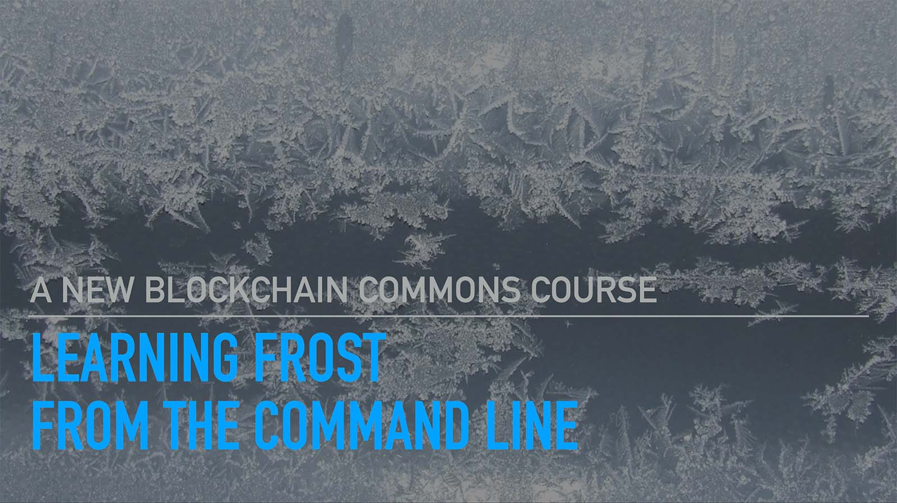

# Learning FROST from the Command Line 0.1
### _by Christopher Allen and Shannon Appelcline_

Learning FROST from the Command Line is a tutorial that explains the
basic of FROST and other Schnorr-based signature systems. It then uses
hands on command-line tools to offer real examples of how to use FROST
for general signing and specifically for signing Bitcoin transactions.

> NOTE: This is a complete first draft, requesting feedback
from early reviewers. It is not yet ready for use.

_This tutorial assumes that you have some minimal background of how to
use the command line interface. If not, there are many tutorials
available, and I have one for Mac users at
https://github.com/ChristopherA/intro-mac-command-line._

* _You may prefer the easy to read [Learning FROST from the Command Line website](https://learningfrost.blockchaincommons.com/)._
* _You may also be interested in our [Learning Bitcoin from the Command Line course](https://github.com/BlockchainCommons/Learning-Bitcoin-from-the-Command-Line/blob/master/README.md)._

## Table of Contents

### PART ONE: LEARNING ABOUT FROST

* [1.0: Introduction to FROST](docs/01_0_Introduction.md)
  * [1.1: Introducing FROST](docs/01_1_Introducing_FROST.md)
  * [1.2: The FROST Signature Process](docs/01_2_FROST_Signature_Process.md)
  * [1.3: FROST vs MuSig2](docs/01_3_FROST_vs_MuSig.md)
 
### PART TWO: FROST FROM THE COMMAND LINE

* [2.0: Signing with FROST](docs/02_0_Signing_with_FROST.md)
  * [2.1: Installing the FROST Tools](docs/02_1_Installing_FROST_Tools.md)
  * [2.2: Creating FROST Secret Shares with TDG](docs/02_2_Creating_FROST_Secret_Shares_with_TDG.md)
  * [2.3: Creating a FROST Signature](docs/02_3_Creating_FROST_Signature.md)
  * [2.4: Checking a FROST Signature](docs/02_4_Checking_FROST_Signature.md)
* [3.0: Advanced FROST Capabilities](docs/03_0_Advanced_FROST.md)  
  * [3.1: Creating FROST Secret Shares with DKG Using CLI](docs/03_1_Creating_FROST_Secret_Shares_with_DKG_Using_CLI.md)
  * [3.2: Creating FROST Secret Shares with DKG Using Server](docs/03_2_Creating_FROST_Secret_Shares_with_DKG_Using_Server.md)
  * [3.3: ZF FROST in a Nutshell](docs/03_3_ZF_FROST_in_a_Nutshell.md)
  * [3.4: Resharing FROST Shares](docs/03_4_Refreshing_FROST_Shares.md)
* [4.0: Using FROST with Bitcoin](docs/04_0_FROST_and_Bitcoin.md)
  * [4.1: Installing the Bitcoin Tools](docs/04_1_Installing_Bitcoin_Tools.md)
  * [4.2: Signing PSBTs with FROST](docs/04_2_Signing_PSBTs_with_FROST.md)
  
## Status - Alpha

v1.0 of Learning FROST is currently in process

#### 1.0.0 (???, 2025)

* Initial release.

## Origin, Authors, Copyright & Licenses

Unless otherwise noted (either in this [/README.md](./README.md) or in
the file's header comments) the contents of this repository are
Copyright © 2025 by Blockchain Commons, LLC, and are licensed under
[CC-BY](./LICENSE-CC-BY-4.0.md).

## Financial Support

*Learning FROST from the Command Line* is a project of [Blockchain Commons](https://www.blockchaincommons.com/). We are proudly a "not-for-profit" social benefit corporation committed to open source & open development. Our work is funded entirely by donations and collaborative partnerships with people like you. Every contribution will be spent on building open tools, technologies, and techniques that sustain and advance blockchain and internet security infrastructure and promote an open web.

To financially support further development of *Learning FROST from the Command Line* and other projects, please consider becoming a Patron of Blockchain Commons through ongoing monthly patronage as a [GitHub Sponsor](https://github.com/sponsors/BlockchainCommons). You can also support Blockchain Commons with bitcoins at our [BTCPay Server](https://btcpay.blockchaincommons.com/).

### Project Sponsor

This project was sponsored by a grant from [HRF](https://hrf.org/),
the Human Rights Foundation.

## Contributing

We encourage public contributions through issues and pull requests! Please review [CONTRIBUTING.md](./CONTRIBUTING.md) for details on our development process. All contributions to this repository require a GPG signed [Contributor License Agreement](./CLA.md).

if you would like to provide a translation of Learning Bitcoin into another language, please additionally see [TRANSLATING.md](./TRANSLATING.md).

### Discussions

The best place to talk about Blockchain Commons and its projects is in our GitHub Discussions areas.

[**Blockchain Commons Discussions**](https://github.com/BlockchainCommons/Community/discussions). For developers, interns, and patrons of Blockchain Commons, please use the discussions area of the [Community repo](https://github.com/BlockchainCommons/Community) to talk about general Blockchain Commons issues, the intern program, or topics other than those covered by the [Gordian Developer Community](https://github.com/BlockchainCommons/Gordian-Developer-Community/discussions) or the 
[Gordian User Community](https://github.com/BlockchainCommons/Gordian/discussions).'

### Other Questions & Problems

As an open-source, open-development community, Blockchain Commons does not have the resources to provide direct support of our projects. Please consider the discussions area as a locale where you might get answers to questions. Alternatively, please use this repository's [issues](../../issues) feature. Unfortunately, we can not make any promises on response time.

If your company requires support to use our projects, please feel free to contact us directly about options. We may be able to offer you a contract for support from one of our contributors, or we might be able to point you to another entity who can offer the contractual support that you need.

### Credits

The following people directly contributed to this repository. You can add your name here by getting involved. The first step is learning how to contribute from our [CONTRIBUTING.md](./CONTRIBUTING.md) documentation.

| Name              | Role                | Github                                            | Email                                 | GPG Fingerprint                                    |
| ----------------- | ------------------- | ------------------------------------------------- | ------------------------------------- | -------------------------------------------------- |
| Christopher Allen | Lead Author | [@ChristopherA](https://github.com/ChristopherA) | \<ChristopherA@LifeWithAlacrity.com\> | FDFE 14A5 4ECB 30FC 5D22  74EF F8D3 6C91 3574 05ED |
| Shannon Appelcline |  Lead Author | [@shannona](https://github.com/shannona) | \<shannon.appelcline@gmail.com\> | 7EC6 B928 606F 27AD |

## Responsible Disclosure

We want to keep all of our software safe for everyone. If you have
discovered a security vulnerability, we appreciate your help in
disclosing it to us in a responsible manner. We are unfortunately not
able to offer bug bounties at this time.

We do ask that you offer us good faith and use best efforts not to leak information or harm any user, their data, or our developer community. Please give us a reasonable amount of time to fix the issue before you publish it. Do not defraud our users or us in the process of discovery. We promise not to bring legal action against researchers who point out a problem provided they do their best to follow the these guidelines.

### Reporting a Vulnerability

Please report suspected security vulnerabilities in private via email to ChristopherA@BlockchainCommons.com (do not use this email for support). Please do NOT create publicly viewable issues for suspected security vulnerabilities.

The following keys may be used to communicate sensitive information to developers:

| Name              | Fingerprint                                        |
| ----------------- | -------------------------------------------------- |
| Christopher Allen | FDFE 14A5 4ECB 30FC 5D22  74EF F8D3 6C91 3574 05ED |

You can import a key by running the following command with that individual’s fingerprint: `gpg --recv-keys "<fingerprint>"` Ensure that you put quotes around fingerprints that contain spaces.
