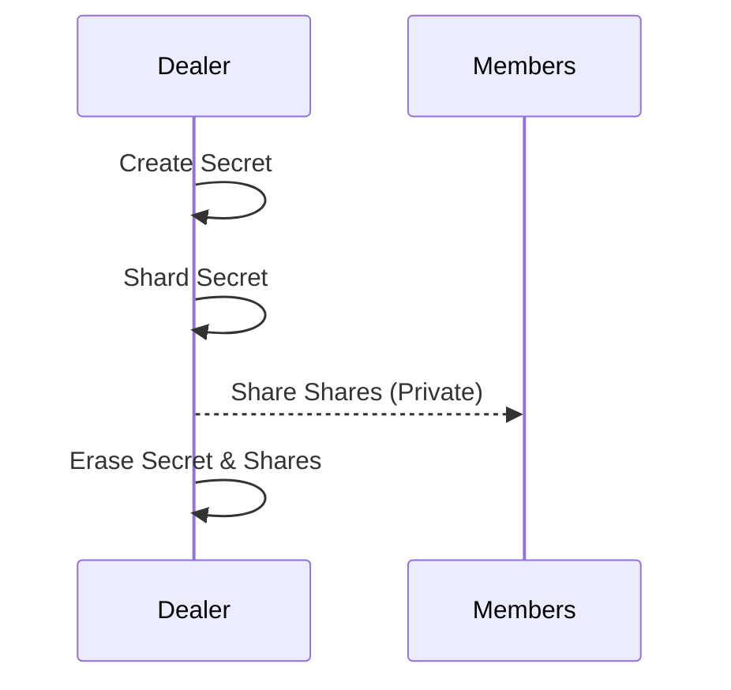
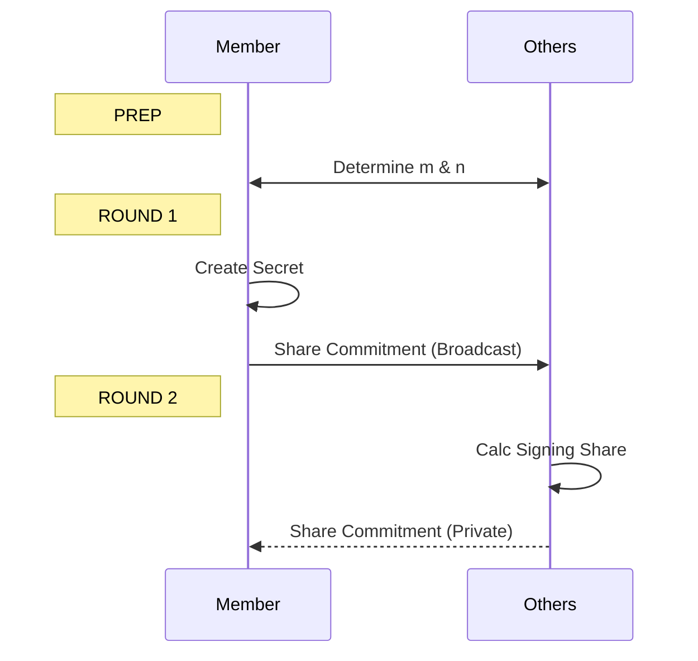
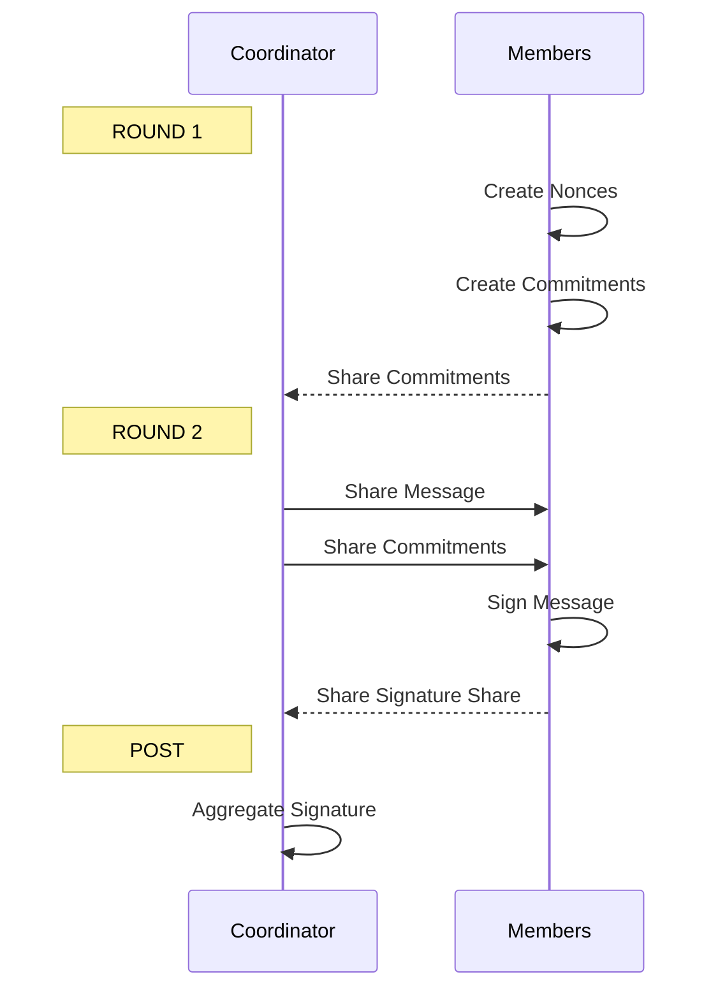
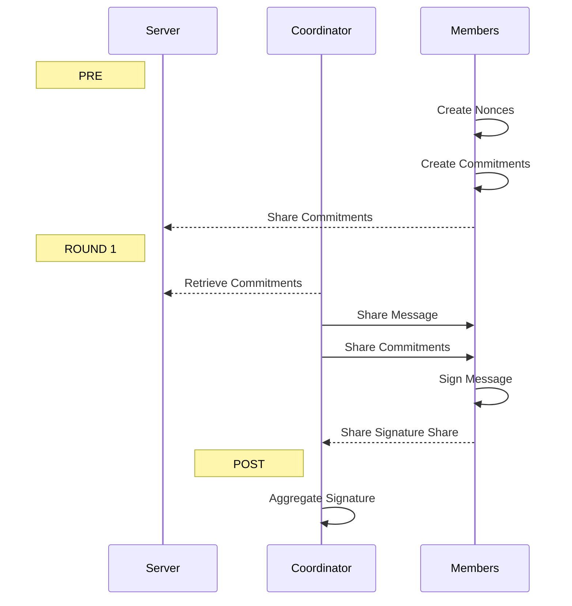

### The Trusted Dealer Generation (TDG) Process



### The Distributed Key Generation (DKG) Process



### Two-Round Signing



### Signing with Pre-Processing



    Note left of Member: POST
    Member->>Member: Finalize
```
