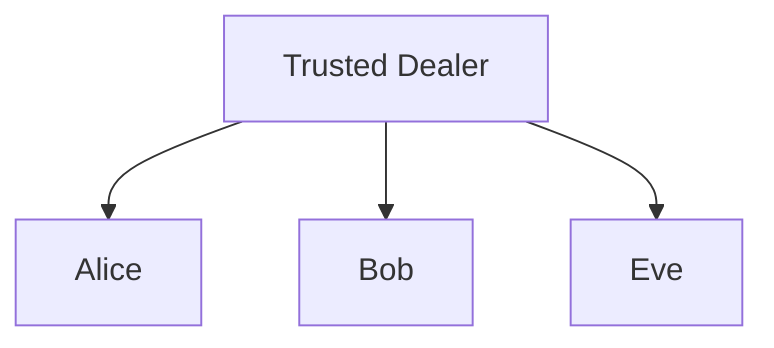
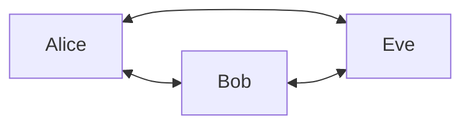
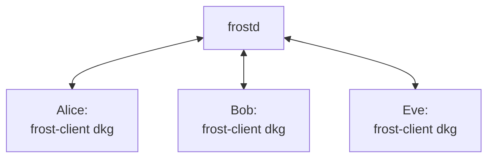
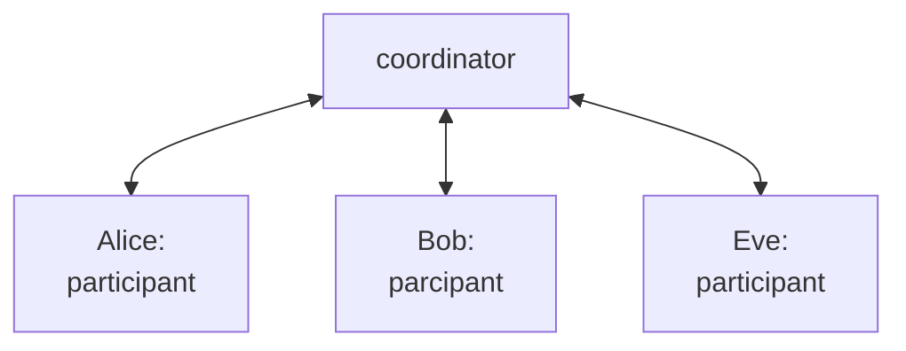
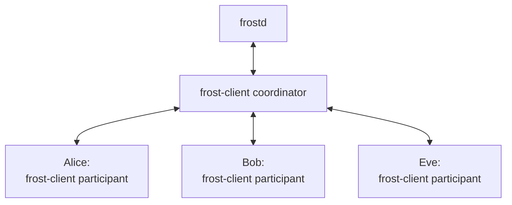

## TDG Share Creation

```mermaid
flowchart TD
TDG[Trusted Dealer]
TDG --> A[Alice]
TDG --> B[Bob]
TDG --> E[Eve]
```

## DKG Share Creation (by Hand)

```mermaid
flowchart LR
A[Alice] <--> B[Bob]
A <--> E[Eve]
B <--> E
```

## DKG Share Creation (with Server)

```mermaid
flowchart TD
DKG[frostd]
DKG <--> A[Alice:
frost-client dkg]
DKG <--> B[Bob:
frost-client dkg]
DKG <--> E[Eve:
frost-client dkg]
```

## TDG Singing

```mermaid
flowchart TD
TDG[coordinator]
TDG <--> A[Alice: 
participant]
TDG <--> B[Bob:
parcipant]
TDG <--> E[Eve:
participant]
```

## DKG Signing

```mermaid
flowchart TD
frostd
DKG[frost-client coordinator]
frostd <--> DKG
DKG <--> A[Alice:
frost-client participant]
DKG <--> B[Bob:
frost-client participant]
DKG <--> E[Eve:
frost-client participant]
```

